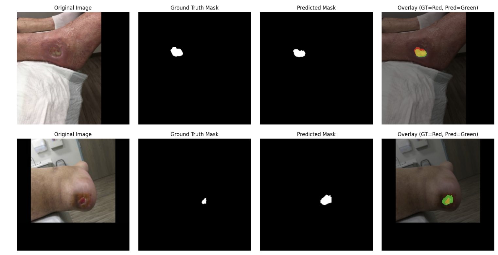

🩹 Wound Image Segmentation using U-Net (Deep Learning)  

📌 Project Overview  

This project implements a U-Net based deep learning model for automated wound segmentation from clinical images.  
The model performs pixel-wise binary segmentation to accurately identify wound regions, demonstrating the application of convolutional neural networks in AI-driven healthcare.  

⸻

🎯 Objective  

To develop and evaluate a deep learning model capable of:  
	•	Identifying wound regions in medical images  
	•	Generating accurate segmentation masks  
	•	Supporting AI-assisted clinical analysis  

⸻

🧠 Model Architecture  
	•	Architecture: U-Net (Encoder–Decoder CNN with Skip Connections)  
	•	Task: Binary Image Segmentation (Background vs Wound)  
	•	Loss Function: Binary Cross Entropy + Dice Loss  
	•	Optimizer: Adam  
	•	Learning Rate: 1e-4  
	•	Epochs: 20  
	•	Framework: PyTorch  

The Dice component improves overlap optimization and helps address class imbalance between wound and background pixels.  

⸻

📊 Model Performance  
	•	Final Training Dice Score: ~0.72  
	•	Final Test Dice Score: ~0.79  
	•	Training loss showed consistent convergence across epochs  

The model demonstrates effective localization of wound regions despite limited dataset size.  

⸻

📈 Training Curves  

The following metrics were tracked during training:  
	•	Training Loss Curve  
	•	Dice Score vs Epochs  

Both curves indicate stable convergence and performance improvement over time.  

⸻

🔍 Sample Predictions  

Each prediction includes:  
	•	Original Image  
	•	Ground Truth Mask  
	•	Predicted Mask  
	•	Overlay Visualization  

Color Coding:  
	•	🟢 Green → Predicted Mask  
	•	🔴 Red → Ground Truth  


Below is an example of wound segmentation using U-Net:




Overlay visualization highlights segmentation accuracy and region overlap.  

⸻

📁 Dataset  
	•	Binary wound segmentation dataset  
	•	Images resized to 224×224  
	•	Masks converted to binary format (0 = background, 1 = wound)  

⚠ Dataset not uploaded due to privacy constraints.  

⸻

⚙️ How to Run  

1.  Clone the repository:
    ```
    git clone https://github.com/tanyaagrawal256/Wound-Image-Segmentation-AI-ML-project.git
    ``` 

2.	Install dependencies:  
	```
    pip install -r requirements.txt
    ```

3.	Open and run:
    ```
	wound_image_segmentation_unet.ipynb
    ```   

⸻

🛠 Tech Stack  
	•	Python  
	•	PyTorch  
	•	NumPy  
	•	OpenCV  
	•	Matplotlib  

⸻

🚀 Future Improvements  
	•	Data augmentation for improved generalization  
	•	Handling class imbalance with Focal Loss  
	•	Hyperparameter tuning  
	•	Larger and more diverse dataset  
	•	Deployment as a web-based inference application  

⸻

📌 Conclusion  

This project demonstrates the application of deep learning for medical image segmentation using U-Net.  
The results indicate that CNN-based architectures can effectively support automated wound analysis and AI-driven healthcare solutions.  

⸻
👩‍⚕️ Author  

Dr. Tanya Agrawal  
BDS | AI and Healthcare Technology Enthusiast  
